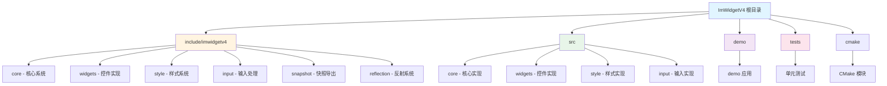

# ImWidgetV4 项目文档

**最后更新时间**: 2026-04-29 21:02:02

## 变更记录 (Changelog)

### 2026-04-29 - 初始化
- 创建项目 AI 上下文文档
- 基于 ImWidgetV3 架构设计
- 参考 ImWidget 控件风格

---

## 项目概述

### 项目愿景

ImWidgetV4 是一个基于 Dear ImGui 图形 API 的现代化控件库，采用保留模式（Retained Mode）架构设计。项目受 Unreal Engine Slate UI 框架启发，提供声明式的控件组合方式和完整的样式系统。

**核心目标**:
- 提供高性能、易用的 UI 控件库
- 支持灵活的样式定制和主题切换
- 实现完整的输入处理和焦点管理
- 提供丰富的内置控件和布局系统
- 支持快照导出和测试自动化

### 技术栈

- **语言**: C++17
- **构建系统**: CMake 3.24+
- **图形 API**: Dear ImGui 1.92.7+
- **测试框架**: Google Test
- **依赖管理**: CMake FetchContent

---

## 架构总览

### 核心设计理念

ImWidgetV4 采用分层架构设计，将 UI 系统分为以下几个核心层次：

1. **核心层 (Core)**: 提供基础的控件系统、属性绑定、事件响应机制
2. **控件层 (Widgets)**: 实现各种具体的 UI 控件
3. **布局层 (Layout)**: 提供灵活的布局容器和排列算法
4. **样式层 (Style)**: 管理控件外观、主题和样式集
5. **输入层 (Input)**: 处理键盘、鼠标等输入事件
6. **应用层 (Application)**: 管理控件树、焦点、渲染循环

### 架构图



### 核心概念

#### 1. Widget (控件)

所有 UI 元素的基类，提供：
- 生命周期管理（构造、渲染、销毁）
- 父子关系管理
- 输入事件处理
- 状态管理（悬停、按下、聚焦）

**关键方法**:
```cpp
class ImWidget {
public:
    // 构造函数
    ImWidget(const std::string& WidgetName);
    
    // 渲染方法
    virtual void Render();
    
    // 输入处理
    virtual void OnMouseDown(ImMouseDownEvent& e);
    virtual void OnMouseUp(ImMouseUpEvent& e);
    virtual void HandleMouseEnter(ImMouseEnterEvent* e);
    virtual void HandleMouseLeave(ImMouseLeaveEvent* e);
    
    // 属性访问
    void SetContent(ImWidget* Child, bool bDeleteOld = true);
    ImWidget* GetContent();
    ImVec2 GetMinSize();
    
    // 状态管理
    bool bVisible = true;
    bool bHovered = false;
    bool bFocused = false;
    
protected:
    std::string m_WidgetName;
    ImWidget* m_Content = nullptr;
};
```

#### 2. 属性系统

控件属性使用直接的 Setter/Getter 方法：
```cpp
class ImButton : public ImPanelWidget {
public:
    // 属性设置
    void SetText(const std::string& Text);
    void SetTextColor(ImU32 Color);
    void SetStyle(const ButtonStateStyle& Style);
    
    // 属性获取
    std::string GetText() const;
    ImU32 GetTextColor() const;
    
private:
    std::string m_Text;
    ImU32 m_TextColor;
    ButtonStateStyle m_NormalStyle;
};
```

**使用示例**:
```cpp
// 设置按钮文本
button->SetText("Click Me");

// 设置文本颜色
button->SetTextColor(IM_COL32(255, 255, 255, 255));

// 设置样式
ButtonStateStyle style;
style.BackgroundColor = IM_COL32(100, 100, 200, 255);
button->SetStyle(style);
```

#### 3. 事件系统

输入事件通过虚函数重写处理：
```cpp
class ImButton : public ImPanelWidget {
protected:
    // 鼠标事件
    virtual void OnMouseDown(ImMouseDownEvent& e) override;
    virtual void OnMouseUp(ImMouseUpEvent& e) override;
    virtual void HandleMouseEnter(ImMouseEnterEvent* e) override;
    virtual void HandleMouseLeave(ImMouseLeaveEvent* e) override;
    
    // 拖拽事件
    virtual void OnDragBegin() override;
    virtual void OnDragCancel() override;
};

// 事件结构
struct ImMouseDownEvent {
    ImVec2 Position;
    int Button;
};

struct ImMouseEnterEvent {
    ImVec2 Position;
};
```

#### 4. 样式系统

控件样式使用独立的样式结构：
```cpp
// 按钮样式
struct ButtonStateStyle {
    ImU32 BackgroundColor;
    ImU32 BorderColor;
    ImU32 TextColor;
    float BorderThickness;
    float CornerRadius;
};

// 文本对齐
enum class TextAlignment_Horizontal {
    Left,
    Center,
    Right
};

enum class TextAlignment_Vertical {
    Top,
    Center,
    Bottom
};

// 使用示例
class ImButton : public ImPanelWidget {
private:
    ButtonStateStyle m_NormalStyle;
    ButtonStateStyle m_HoveredStyle;
    ButtonStateStyle m_PressedStyle;
    
public:
    void SetNormalStyle(const ButtonStateStyle& Style);
    void SetHoveredStyle(const ButtonStateStyle& Style);
    void SetPressedStyle(const ButtonStateStyle& Style);
};
```

#### 5. 全局管理

使用全局单例管理事件和操作：
```cpp
// 事件总线
template<typename KeyType>
class EventBus {
public:
    static EventBus<KeyType>* GetEventBusInstance();
    
    void Subscribe(const KeyType& EventKey, std::function<void(void*)> Handler);
    void Publish(const KeyType& EventKey, void* Data = nullptr);
    void Unsubscribe(const KeyType& EventKey);
};

// 操作系统
template<typename KeyType>
class ActionSystem {
public:
    static ActionSystem<KeyType>* GetActionSystemInstance();
    
    void RegisterAction(const KeyType& ActionKey, std::function<void()> Action);
    void ExecuteAction(const KeyType& ActionKey);
};

// 编辑器全局
class EditorGlobal {
public:
    static EventBus<KeyStringType>* GetEventBusInstance();
    static ActionSystem<KeyStringType>* GetActionSystemInstance();
};

// 使用示例
using KeyStringType = std::string;
const KeyStringType UI_FILE_SELECTED = "UIFileSelected";

// 订阅事件
EditorGlobal::GetEventBusInstance()->Subscribe(UI_FILE_SELECTED, 
    [](void* Data) {
        // 处理事件
    });

// 发布事件
EditorGlobal::GetEventBusInstance()->Publish(UI_FILE_SELECTED, data);
```

---

## 目录结构

```
ImWidgetV4/
├── include/imwidgetv4/          # 公共头文件
│   ├── imwidgetv4.h            # 主头文件
│   ├── core/                   # 核心系统
│   │   ├── Application.h       # 应用程序管理
│   │   ├── Widget.h            # 控件基类
│   │   ├── Attribute.h         # 属性系统
│   │   ├── Reply.h             # 事件响应
│   │   ├── Types.h             # 基础类型定义
│   │   └── Commands.h          # 命令系统
│   ├── widgets/                # 控件实现
│   │   ├── Button.h            # 按钮
│   │   ├── TextBlock.h         # 文本显示
│   │   ├── EditableText.h      # 文本输入
│   │   ├── CheckBox.h          # 复选框
│   │   ├── ComboBox.h          # 下拉框
│   │   ├── ListView.h          # 列表视图
│   │   ├── TreeView.h          # 树形视图
│   │   ├── HorizontalBox.h     # 水平布局
│   │   ├── VerticalBox.h       # 垂直布局
│   │   ├── ScrollBox.h         # 滚动容器
│   │   ├── Border.h            # 边框容器
│   │   ├── Overlay.h           # 叠加容器
│   │   ├── Spacer.h            # 空白占位
│   │   ├── Image.h             # 图片显示
│   │   ├── MenuBar.h           # 菜单栏
│   │   ├── ContextMenu.h       # 右键菜单
│   │   ├── ToolBar.h           # 工具栏
│   │   ├── CommandPalette.h    # 命令面板
│   │   ├── DetailsView.h       # 详情视图
│   │   └── Form.h              # 表单
│   ├── style/                  # 样式系统
│   │   └── StyleSet.h          # 样式集定义
│   ├── input/                  # 输入处理
│   │   └── Input.h             # 输入事件定义
│   ├── snapshot/               # 快照导出
│   │   └── Snapshot.h          # 快照功能
│   └── reflection/             # 反射系统
│       └── Reflection.h        # 类型反射
├── src/                        # 源代码实现
│   ├── core/                   # 核心实现
│   │   ├── Application.cpp
│   │   ├── Widget.cpp
│   │   └── Commands.cpp
│   ├── widgets/                # 控件实现
│   │   ├── Button.cpp
│   │   ├── TextBlock.cpp
│   │   ├── EditableText.cpp
│   │   └── ...
│   ├── style/                  # 样式实现
│   │   └── StyleSet.cpp
│   ├── input/                  # 输入实现
│   │   └── Input.cpp
│   ├── snapshot/               # 快照实现
│   │   └── Snapshot.cpp
│   └── reflection/             # 反射实现
│       └── Reflection.cpp
├── demo/                       # 演示程序
│   ├── CMakeLists.txt
│   └── main.cpp
├── tests/                      # 单元测试
│   ├── CMakeLists.txt
│   └── ...
├── cmake/                      # CMake 模块
│   ├── ImWidgetV4Config.cmake.in
│   ├── ImWidgetV4CompilerWarnings.cmake
│   └── CheckImGuiApiUsage.cmake
├── CMakeLists.txt              # 主构建文件
├── CLAUDE.md                   # 本文档
└── .claude/                    # AI 上下文索引
    └── index.json
```

---

## 模块索引

### 核心模块

| 模块路径 | 职责描述 | 关键文件 |
|---------|---------|---------|
| `include/imwidgetv4/core` | 核心系统：控件基类、属性、事件、应用管理 | Widget.h, Application.h, Attribute.h |
| `include/imwidgetv4/widgets` | 控件实现：按钮、文本、列表、布局等 | Button.h, ListView.h, HorizontalBox.h |
| `include/imwidgetv4/style` | 样式系统：主题、颜色、控件样式 | StyleSet.h |
| `include/imwidgetv4/input` | 输入处理：键盘、鼠标事件 | Input.h |
| `include/imwidgetv4/snapshot` | 快照导出：UI 截图、测试支持 | Snapshot.h |
| `include/imwidgetv4/reflection` | 反射系统：类型信息、序列化 | Reflection.h |

---

## 控件设计规范

### 控件命名规范

- 所有控件类以 `Im` 开头（ImGui Widget 缩写）：`ImButton`, `ImTextBlock`, `ImListView`
- 样式结构使用 PascalCase + `Style` 后缀：`ButtonStateStyle`, `ListViewStyle`
- 枚举类型使用 PascalCase：`TextAlignment_Horizontal`, `CheckBoxState`

### 控件实现模式

每个控件应实现以下标准接口：

```cpp
class ImMyWidget : public ImWidget {
public:
    // 构造函数
    ImMyWidget(const std::string& WidgetName);
    
    // 属性设置
    void SetProperty(Type value);
    Type GetProperty() const;
    
    // 事件回调
    void SetOnEvent(std::function<void()> callback);
    
    // 样式定制
    void SetStyle(const MyWidgetStyle& style);
    
protected:
    // 渲染实现
    virtual void Render() override;
    
    // 布局处理
    virtual void Relayout() override;
    
    // 输入处理
    virtual void HandleEventInternal(ImEvent* event) override;
    
    // 获取最小尺寸
    virtual ImVec2 GetMinSize() override;
    
private:
    // 成员变量
    std::string m_WidgetName;
    Type m_Property;
    std::function<void()> m_OnEvent;
    MyWidgetStyle m_NormalStyle;
    MyWidgetStyle m_HoveredStyle;
    MyWidgetStyle m_PressedStyle;
    bool bHasStyleOverride = false;
};
```

### 控件状态管理

控件应维护以下状态：
- **Hovered**: 鼠标悬停状态
- **Pressed**: 按下状态
- **Focused**: 焦点状态
- **Disabled**: 禁用状态
- **Checked**: 选中状态（适用于复选框等）

### 样式继承

控件样式遵循以下优先级：
1. 控件实例的样式覆盖（`SetNormalStyle`, `SetHoveredStyle`, `SetPressedStyle`）
2. 应用程序的全局样式集
3. 控件的默认样式

---

## 构建系统

### CMake 配置

**主要选项**:
```cmake
option(IMWIDGETV4_BUILD_DEMO "构建 GLFW/OpenGL3 演示程序" ON)
option(IMWIDGETV4_BUILD_TESTS "构建 Google Test 测试" ON)
option(IMWIDGETV4_ENABLE_SNAPSHOT "启用快照导出支持" ON)
option(IMWIDGETV4_USE_STATIC_MSVC_RUNTIME "链接静态 MSVC 运行时" ON)
```

**依赖管理**:
- Dear ImGui: 通过 FetchContent 自动获取
- GLFW: 用于演示程序（可选）
- Google Test: 用于单元测试（可选）

### 构建步骤

```bash
# 配置
cmake -B build -S . -DCMAKE_BUILD_TYPE=Release

# 编译
cmake --build build --config Release

# 安装
cmake --install build --prefix /path/to/install

# 运行测试
cd build
ctest -C Release
```

### 集成到其他项目

**方式 1: find_package**
```cmake
find_package(ImWidgetV4 REQUIRED)
target_link_libraries(MyApp PRIVATE imwidgetv4::imwidgetv4)
```

**方式 2: FetchContent**
```cmake
include(FetchContent)
FetchContent_Declare(
    imwidgetv4
    GIT_REPOSITORY https://github.com/yourorg/imwidgetv4.git
    GIT_TAG main
)
FetchContent_MakeAvailable(imwidgetv4)
target_link_libraries(MyApp PRIVATE imwidgetv4::imwidgetv4)
```

---

## 运行与开发

### 快速开始

```cpp
#include <imwidgetv4/imwidgetv4.h>

int main() {
    // 初始化 ImGui 上下文
    ImGui::CreateContext();
    
    // 创建根控件
    ImVerticalBox* rootWidget = new ImVerticalBox("RootWidget");
    
    // 添加文本控件
    ImTextBlock* textBlock = new ImTextBlock("TextBlock");
    textBlock->SetText("Hello ImWidgetV4!");
    textBlock->SetTextColor(IM_COL32(255, 255, 255, 255));
    rootWidget->AddChild(textBlock);
    
    // 添加按钮控件
    ImButton* button = new ImButton("MyButton");
    button->SetText("Click Me");
    
    // 设置按钮样式
    ButtonStateStyle normalStyle;
    normalStyle.BackgroundColor = IM_COL32(100, 100, 200, 255);
    normalStyle.BorderColor = IM_COL32(150, 150, 250, 255);
    normalStyle.TextColor = IM_COL32(255, 255, 255, 255);
    button->SetNormalStyle(normalStyle);
    
    rootWidget->AddChild(button);
    
    // 主循环
    while (!glfwWindowShouldClose(window)) {
        // 处理输入
        glfwPollEvents();
        
        // 开始新帧
        ImGui_ImplOpenGL3_NewFrame();
        ImGui_ImplGlfw_NewFrame();
        ImGui::NewFrame();
        
        // 渲染控件树
        rootWidget->Render();
        
        // 渲染
        ImGui::Render();
        ImGui_ImplOpenGL3_RenderDrawData(ImGui::GetDrawData());
        glfwSwapBuffers(window);
    }
    
    // 清理
    delete rootWidget;
    ImGui::DestroyContext();
    return 0;
}
```

### 开发工作流

1. **添加新控件**
   - 在 `include/imwidgetv4/widgets/` 创建头文件
   - 在 `src/widgets/` 创建实现文件
   - 更新 `CMakeLists.txt` 添加源文件
   - 在 `include/imwidgetv4/imwidgetv4.h` 中包含新头文件

2. **添加样式**
   - 在 `StyleSet.h` 中定义样式结构
   - 在 `StyleSet.cpp` 中实现默认样式
   - 在控件中使用 `ResolveStyle()` 获取样式

3. **编写测试**
   - 在 `tests/` 目录创建测试文件
   - 使用 Google Test 框架
   - 运行 `ctest` 验证

---

## 测试策略

### 单元测试

使用 Google Test 框架，覆盖：
- 核心类功能（Widget、Application、Attribute）
- 控件行为（布局、绘制、输入）
- 样式系统（主题切换、样式继承）
- 输入处理（事件路由、焦点管理）

**测试示例**:
```cpp
TEST(ButtonTest, ClickEvent) {
    ImButton* button = new ImButton("Test");
    bool clicked = false;
    button->OnLeftClicked.AddLambda([&]() { clicked = true; });
    
    // 模拟点击事件
    ImMouseDownEvent event;
    event.Position = ImVec2(10, 10);
    event.Button = ImMouseButton::Left;
    
    button->HandleMouseDown(&event);
    EXPECT_TRUE(clicked);
    
    delete button;
}
```

### 快照测试

使用快照导出功能进行视觉回归测试：
```cpp
TEST(SnapshotTest, ButtonAppearance) {
    ImApplication* app = new ImApplication();
    ImButton* button = new ImButton("Test");
    app->SetRootWidget(button);
    
    // 捕获快照
    ImSnapshotOptions options;
    options.Width = 200;
    options.Height = 100;
    auto snapshot = app->CaptureSnapshot(options);
    
    // 导出并比较
    app->ExportSnapshotToPng("test_button.png", options);
    // 使用图像比较工具验证
    
    delete app;
}
```

---

## 编码规范

### 命名约定

- **类名**: PascalCase，控件类使用 `Im` 前缀（`ImWidget`, `ImButton`, `ImTextBlock`）
- **函数名**: PascalCase（`SetContent`, `GetMinSize`, `HandleMouseDown`）
- **成员变量**: `m_` 前缀 + PascalCase（`m_Text`, `m_TextColor`, `m_RootWidget`）
- **布尔成员变量**: `b` 前缀 + PascalCase（`bVisible`, `bHovered`, `bPressed`）
- **参数**: PascalCase（`const std::string& Text`, `bool bDeleteOld`）
- **常量**: PascalCase 或 UPPER_SNAKE_CASE
- **命名空间**: PascalCase（`ImGuiWidget`）

### 代码风格

- **缩进**: 4 空格
- **大括号**: Allman 风格（独立一行）
- **指针/引用**: 符号靠近类型（`int* ptr`, `const std::string& str`）
- **const 正确性**: 尽可能使用 const
- **智能指针**: 优先使用 `std::shared_ptr` 和 `std::weak_ptr`

### 注释规范

```cpp
/**
 * @brief 获取控件的最小尺寸
 * 
 * 在布局阶段被调用，用于确定控件在理想情况下需要的空间大小。
 * 
 * @return ImVec2 期望的宽度和高度
 */
virtual ImVec2 GetMinSize();
```

### 错误处理

- 使用断言检查前置条件：`assert(widget != nullptr)`
- 返回值表示成功/失败：`bool TryExecuteCommand(...)`
- 避免异常，使用错误码或可选类型

---

## AI 使用指引

### 常见任务

**1. 添加新控件**
```
请帮我创建一个新的滑块控件 ImSlider，支持：
- 水平和垂直方向
- 最小值、最大值、当前值
- 值变化回调
- 自定义样式
参考 ImButton 和 ImCheckBox 的实现模式
```

**2. 修改样式**
```
请为 ImButton 添加一个新的样式预设"Dark Blue"，
主色调使用深蓝色 (#1e3a5f)，强调色使用亮蓝色 (#4a90e2)
```

**3. 调试布局问题**
```
ImVerticalBox 中的子控件没有正确排列，
请检查 Render 方法的实现，确保正确计算每个子控件的位置
```

**4. 优化性能**
```
分析控件树渲染的性能瓶颈，
特别是 Render 方法的调用频率和 ImGui 绘制命令的优化
```

### 项目上下文

在与 AI 交互时，可以引用以下关键概念：
- **控件树**: 由 ImWidget 组成的层次结构
- **渲染流程**: 父控件调用子控件的 Render 方法
- **事件处理**: 通过虚函数重写处理鼠标和键盘事件
- **样式系统**: 每个控件维护自己的样式状态（Normal、Hovered、Pressed）
- **全局管理**: 使用 EventBus 和 ActionSystem 进行跨控件通信

### 代码生成提示

生成代码时请遵循：
- 使用项目的命名规范（Im 前缀、m_ 前缀、b 前缀）
- 包含必要的头文件和命名空间
- 实现完整的构造函数、属性 Setter/Getter、事件处理虚函数
- 提供样式定制接口
- 使用 PascalCase 命名所有公共方法和参数

---

## 参考资源

### 相关项目

- **ImWidgetV3**: E:\project\ImWidgetV3 - 本项目的架构基础
- **ImWidget**: E:\project\ImWidget - 控件风格参考

### 外部文档

- [Dear ImGui 官方文档](https://github.com/ocornut/imgui)
- [Unreal Engine Slate UI](https://docs.unrealengine.com/en-US/ProgrammingAndScripting/Slate/)
- [CMake 文档](https://cmake.org/documentation/)

### 设计参考

- **Slate UI Framework**: 声明式 UI、保留模式、样式系统
- **WPF/XAML**: 属性绑定、数据模板
- **React**: 组件化、状态管理

---

## 下一步计划

### 短期目标（当前迭代）

1. 搭建基础项目结构
2. 实现核心类（ImWidget、ImApplication）
3. 实现基础控件（ImButton、ImTextBlock、ImHorizontalBox、ImVerticalBox）
4. 实现基础样式系统
5. 创建简单的演示程序

### 中期目标

1. 完善控件库（列表、树形、表单等）
2. 实现完整的输入处理和焦点管理
3. 添加快照导出功能
4. 编写单元测试和文档
5. 优化性能和内存使用

### 长期目标

1. 支持动画系统
2. 支持拖放操作
3. 支持自定义渲染器
4. 提供可视化编辑器
5. 构建示例应用和教程

---

## 联系与贡献

本项目处于早期开发阶段，欢迎贡献代码、报告问题或提出建议。

**开发环境要求**:
- C++17 编译器（MSVC 2019+, GCC 9+, Clang 10+）
- CMake 3.24+
- Git

**贡献流程**:
1. Fork 项目仓库
2. 创建功能分支
3. 提交代码并编写测试
4. 发起 Pull Request

---

*本文档由 AI 辅助生成，基于 ImWidgetV3 架构分析和 ImWidget 控件设计参考。*
